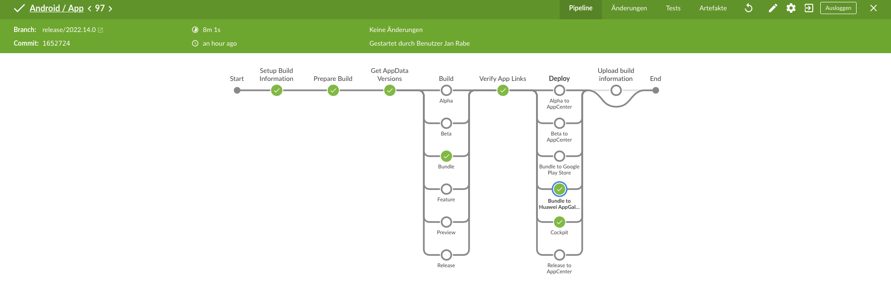

# Deploy App Bundle To Huawei AppGallery

Deploys app bundle to Huawei App Gallery. Jenkins & gradle task based on [Bitrise Task](https://github.com/ferPrieto/steps-app-gallery-deploy/blob/main/step.sh)

### Support

[Jenkins](deploy-app-bundle-to-huawei-appgallery/Jenkinsfile.groovy)

[Gradle Module](deploy-app-bundle-to-huawei-appgallery/build.gradle)

# Requirements

https://developer.huawei.com/consumer/en/doc/development/AppGallery-connect-Guides/agcapi-getstarted-0000001111845114
IMPORTANT: when creating api key: 'N/A' as Project

**clientId**

**clientSecret**

**appId**

### How to use

##### Plain Gradle

```sh
# provided artifact
AAB=$(find "$(pwd -P)" -name "*.aab")

./gradlew updateAppFileInfo --s  \
    -Paab=$AAB -PclientId=${clientId} \
    -PclientSecret=${clientSecret} \
    -PappId=${appId} \
    -PsubmitForReview=false \
    -PreleaseType=1  # 1: on the entire network, 3: by phase
```

##### Jenkins Stage

```
def functions = load "deploy-app-bundle-to-huawei-appgallery/PipelineFunctions.groovy"
functions.deployBundleToAppGallery(aab, clientId, clientSecret, appId)
```

[](Screenshot.png)

## Contributors

- [Jan Rabe](https://kibotu.net)

### License
<pre>
Copyright 2022 Jan Rabe

Licensed under the Apache License, Version 2.0 (the "License");
you may not use this file except in compliance with the License.
You may obtain a copy of the License at

   http://www.apache.org/licenses/LICENSE-2.0

Unless required by applicable law or agreed to in writing, software
distributed under the License is distributed on an "AS IS" BASIS,
WITHOUT WARRANTIES OR CONDITIONS OF ANY KIND, either express or implied.
See the License for the specific language governing permissions and
limitations under the License.
</pre>
